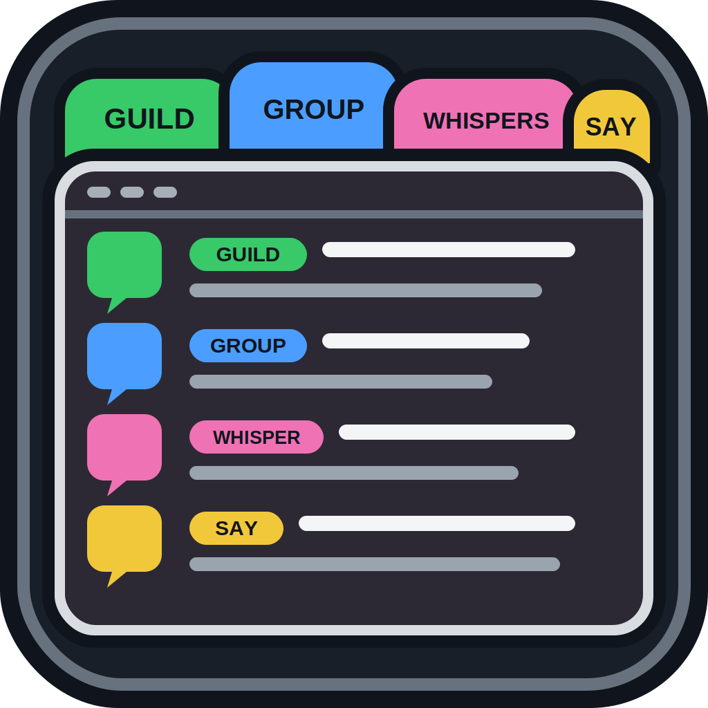

# Chat Tabs Organizer

<p align="center">
  
</p>

Chat Tabs Organizer is a World of Warcraft Retail addon that helps keep chat windows separated by purpose: guild, party/raid, communities, trade/services, whispers, and local channels.

## How It Works

Open the settings from **Options > AddOns > Chat Tabs Organizer** or with:

```text
/ctabs options
```

The addon does not create or change chat tabs when you log in. Routing changes happen only when you click **Apply Now**.

When applied, the addon can:

- create selected chat tabs if they are missing
- reuse existing tabs instead of creating duplicates
- remove managed tabs you unchecked
- route guild chat into Guild
- route party, raid, raid warning, and instance chat into Party
- route communities into Communities
- route trade and services channels into Trade and Services
- optionally manage whispers and local channels
- immediately join named channels from enabled managed tabs with **Join selected channels**

Visual settings are live and apply to all current chat tabs, including tabs the addon did not create. You can change:

- background color
- background opacity
- font face
- font size

**Join selected channels** works immediately and does not change tabs or filters. **Auto-join named channels** instead attempts the same joins when you click **Apply Now**.

## Install

1. Put the `ChatTabsOrganizer` folder in your Retail `Interface/AddOns` folder.
2. Restart the game or run `/reload`.
3. Open the addon settings and choose the tabs you want.
4. Click **Apply Now** to create, update, or remove managed tabs.

## Commands

```text
/ctabs options
/ctabs reset
/ctabs tab guild on
/ctabs tab trade off
```

## License

All rights reserved unless a different license is added.
